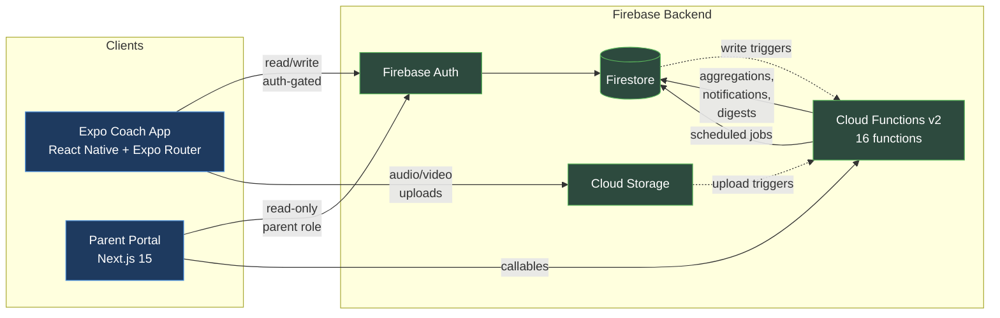

# BSPC Coach App

[](https://github.com/KevinBigham/BSPC-Coach-App/actions/workflows/ci.yml)
[](https://github.com/KevinBigham/BSPC-Coach-App/actions/workflows/functions-deploy.yml)
[](LICENSE)
[](package.json)
[](tsconfig.json)
[](#quality-checks)

BSPC Coach App is an open-source Expo and Firebase toolkit for youth swim teams to manage attendance, schedules, meet context, swimmer notes, parent coordination, and coach communication.

The project is built for the Blue Springs Power Cats and is intended to be useful to other youth swim programs that need safer, clearer day-to-day operations without stitching together spreadsheets, group chats, paper notes, and ad hoc meet reminders.

## Verify In 60 Seconds

For reviewers who want to confirm this is real and green:

```bash
git clone https://github.com/KevinBigham/BSPC-Coach-App.git
cd BSPC-Coach-App

npm ci --legacy-peer-deps
npm --prefix functions ci
npm --prefix parent-portal ci

# Static and behavioral checks (no Firebase project required):
npm run typecheck
npm run lint:errors
npm run quality:dead-code      # knip — dead code / unused exports
npm run madge:circular         # circular dependency check
npm test -- --runInBand        # 939 tests across 97 suites
npm --prefix functions test -- --runInBand   # 102 tests across 17 suites
npm --prefix functions run build
```

CI runs the entire `npm run quality` stack on every push to `main`. The badges above reflect the live state.

## Who It Serves

- Coaches who need fast roster, attendance, practice, schedule, and swimmer-context tools on deck.
- Families who need clearer team coordination through the parent portal workstream.
- Swimmers whose practice notes, times, media consent, and family access need to be handled carefully.
- Maintainers reviewing a real youth-sports app with privacy, data integrity, and operational safety constraints.

## Current Status

- Active development for the Blue Springs Power Cats coaching workflow; release and pilot-readiness notes live under `docs/release/`.
- Current app release baseline: `v1.3.0`.
- The Expo coach app is the primary runtime.
- The Next.js parent portal is scaffolded and under active development.
- Firebase security rules, Cloud Functions, unit tests, critical-operation tests, and CI are present.

No usage metrics, adoption claims, star counts, or contributor counts are asserted here.

## At A Glance

| | |
|---|---|
| **Coach app screens** | 47 (Expo Router) |
| **Service modules** | 32 |
| **Cloud Functions** | 16 (triggers, callables, scheduled) |
| **TypeScript LoC** | ~38.5k across coach app, parent portal, and functions |
| **Tests** | 1,041 across 114 suites (client + functions) |
| **Quality gates in CI** | typecheck · lint · jest (×2) · functions build · parent portal build · knip · madge · sync verify · strict-types · randomness · process |
| **License** | MIT |

## What The App Does

- Roster and swimmer profile management.
- Attendance check-in with group-first workflows.
- Practice planning and workout library support.
- Calendar, announcements, notifications, and daily digest infrastructure.
- Meet information views and imported meet-result context.
- Swimmer notes, goals, times, standards, and analytics.
- Parent invites and role-aware parent portal data access.
- Audio/video coaching workflows with COPPA and SafeSport media-consent guardrails.

## Architecture



Cloud Functions break down into **8 Firestore/Storage triggers** (attendance, times, notes, video, audio, drafts, notifications, rule evaluation), **4 callables** (parent invites, parent portal data, topic subscriptions), and **3 scheduled jobs** (daily digest, calendar sync, aggregation rebuild).

## Tech Stack

- **Mobile**: React Native 0.81, Expo SDK 54, Expo Router 6, TypeScript 5 strict.
- **State and UI**: Zustand 5, React Context, lucide-react-native, custom BSPC theme tokens.
- **Backend**: Firebase Auth, Firestore, Cloud Storage, Cloud Functions v2 (Node 20).
- **Parent portal**: Next.js 15, React 19, TypeScript 5, Firebase Web SDK 12.
- **Testing**: Jest 29, jest-expo, React Native Testing Library, Firebase mocks.
- **CI and deploy**: GitHub Actions, EAS Build, Firebase deploy workflow.
- **Observability**: optional Sentry integration.

## Repository Map

```text
app/                 Expo Router screens for the coach app
src/components/      Shared React Native UI components
src/config/          Firebase, Sentry, theme, and app constants
src/hooks/           Testable data-loading hooks
src/services/        Firebase service layer and import/export logic
src/stores/          Zustand stores
src/types/           Shared TypeScript types
src/utils/           Time math, media consent, notification-rule helpers
functions/           Firebase Cloud Functions
parent-portal/       Next.js parent portal
docs/                Release, verification, and process docs
e2e/                 Maestro flow stubs and E2E notes
test/                Critical-operation regression tests
scripts/             Local maintenance and seed scripts
```

## Local Setup

Prerequisites:

- Node.js 20.
- npm.
- Expo CLI through `npx expo`.
- Firebase project access if you need live auth, Firestore, Storage, or Functions.
- EAS CLI credentials only for native cloud builds.

Install dependencies:

```bash
npm ci --legacy-peer-deps
npm --prefix functions ci
npm --prefix parent-portal ci
```

Create local environment files:

```bash
cp .env.example .env
```

Fill `.env` with your own Firebase project values. Do not commit `.env`, service-account JSON, native signing credentials, roster spreadsheets, exported meet files, or real family/swimmer data.

Start the Expo app:

```bash
npm start
```

Start the parent portal:

```bash
npm --prefix parent-portal run dev
```

Run Cloud Functions locally:

```bash
npm --prefix functions run serve
```

## Environment Variables

See [.env.example](.env.example) for all documented local placeholders.

Important defaults:

- `EXPO_PUBLIC_*` and `NEXT_PUBLIC_*` values are browser/mobile client configuration. They are public by design and must not contain secrets.
- Firebase service-account JSON, EAS credentials, Apple credentials, and Firebase deploy tokens are secrets. Keep them outside git.
- GitHub Actions expects repository secrets such as `EXPO_TOKEN` and `FIREBASE_TOKEN` for deployment workflows.
- EAS build profiles intentionally do not commit Firebase app config values. Configure the `EXPO_PUBLIC_*` values in EAS environment variables before native builds.

## Quality Checks

Core checks:

```bash
npm run sync:functions-shared:verify
npm run typecheck
npm run lint:errors
npm test -- --runInBand
npm --prefix functions test -- --runInBand
npm --prefix functions run build
npm --prefix parent-portal run typecheck
npm --prefix parent-portal run lint
npm --prefix parent-portal run build
```

Full local quality gate:

```bash
npm run quality
npm run quality:dead-code
```

Native production builds are EAS-backed:

```bash
npm run build:preview
npm run build:prod
```

## How This Project Is Built

The repository is developed with an explicit multi-agent workflow:

| Role | Agent | Output |
|---|---|---|
| Architect | ChatGPT | Sprint plans and structured handoff payloads |
| Builder | OpenAI Codex | Branch-level code changes per handoff |
| Reviewer / Ops | Claude Code | Cross-cutting review, CI/deploy fixes, status logs |
| Director | Maintainer | Scope, priority, merge decisions |

Handoffs are explicit: `.codex/handoff.json` carries the next instruction set; `.codex/status.md` and `.codex/changelog.md` are the engineering log read by every agent at session start.

Quality is enforced by CI rather than by trust:

- **Static**: `tsc --noEmit` strict, ESLint with errors-only gate, `knip` (dead exports), `madge` (circular deps), `sync:functions-shared:verify` (autogen mirror invariant).
- **Behavioral**: 1,041 Jest tests, including a `test/critical-ops/` corpus that locks down behavior around attendance, parent invites, notification rules, time math, and media consent.
- **Domain-specific**: `quality:strict-types` (no implicit `any` in domain modules), `quality:randomness` (no `Math.random` in deterministic logic), `quality:process` (sim-engine process integrity).

Every push to `main` runs the full stack via [`ci.yml`](.github/workflows/ci.yml). See [CODEBASE_AUDIT.md](CODEBASE_AUDIT.md) for the architecture and process audit.

## Security And Privacy

This app can handle data about minors, families, coaches, schedules, attendance, notes, media consent, audio/video artifacts, and parent access. Treat privacy and security as product requirements, not polish.

- Do not post real swimmer or family data in public issues, screenshots, tests, fixtures, or PR descriptions.
- Do not bypass Firebase Auth, Firestore rules, role checks, invite redemption, notification authorization, or COPPA/SafeSport media-consent gates.
- Do not commit `.env`, service-account files, native signing credentials, roster spreadsheets, meet exports, or production data dumps.
- Keep all swim times stored as hundredths of seconds.
- Use `addTime()` for PR detection so prior PRs are unflagged atomically.
- See [SECURITY.md](SECURITY.md) for responsible disclosure guidance.

## Roadmap

See [ROADMAP.md](ROADMAP.md) for the current maintainer-facing roadmap. Near-term work focuses on:

- Parent portal hardening and launch readiness.
- Redacted screenshots and demo data.
- E2E coverage for critical coach and parent flows.
- Meet onboarding after recent feature-prune work removed the broad in-app meet-creation flow.
- Continued privacy, media-consent, and notification-rule hardening.

## Contributing

Contributions are welcome when they are small, testable, and privacy-conscious. Start with [CONTRIBUTING.md](CONTRIBUTING.md), open focused PRs, and include the exact checks you ran.

Security reports should follow [SECURITY.md](SECURITY.md), not public issue threads.

## License

This project is released under the [MIT License](LICENSE).

## Maintainer

Maintained by Kevin Bigham for the Blue Springs Power Cats coaching workflow. The project is open for review and contribution, but production team data, credentials, and private family/swimmer context are not part of the open-source repository.
